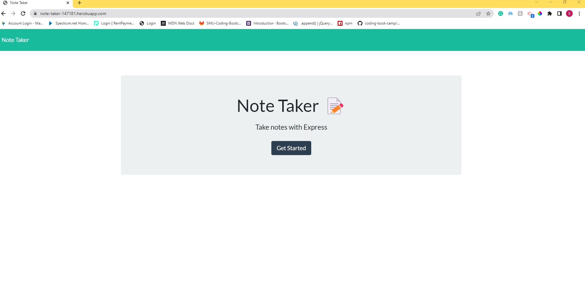
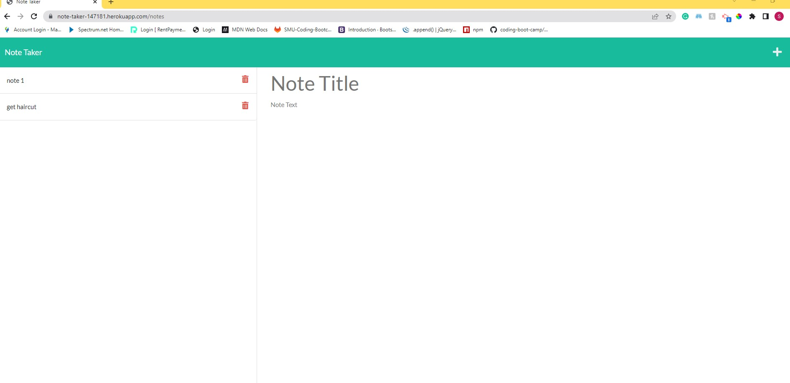
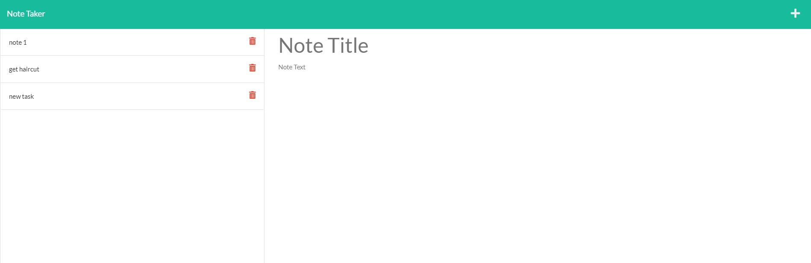
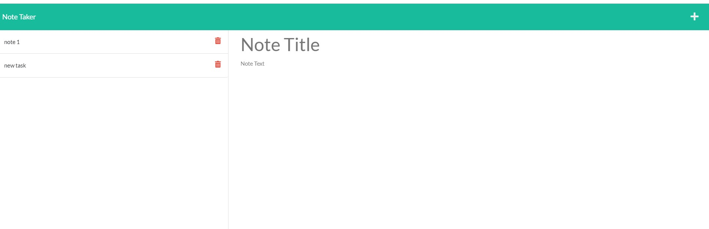

# Note Taker

## Description

Note Taker application that can be used to write and save notes in website.

## Table of contents

-[Installation](#Installation) -[Usage](#Usage) -[Contribution](#Contribution) -[Questions](#Questions) -[Website](#Website) -[Screenshots](#Screenshots)

## Installation

- npm init
- npm i express

## Usage

- npm start

## Contribution

Sumit Ojha

## Questions

- sumit.ojha.dev@gmail.com
- https://github.com/sumitsann

## Website

https://note-taker-147181.herokuapp.com/

## Screenshots

